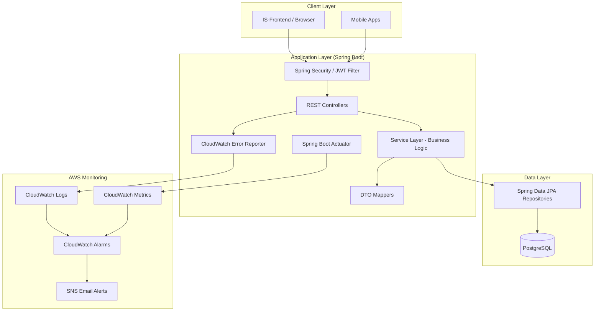

# Architecture: IS-Backend

## High-level Overview
The `IS-Backend` is a Spring Boot application built using a **Layered Architecture**. This ensures a clear separation of concerns, improves maintainability, and facilitates testing.

## Technical Stack
- **Framework**: [Spring Boot 4.0.4](https://spring.io/projects/spring-boot)
- **Language**: [Java 21](https://www.oracle.com/java/technologies/downloads/#java21)
- **Database**: [PostgreSQL 15+](https://www.postgresql.org/)
- **Migrations**: [Flyway](https://flywaydb.org/)
- **Persistence**: [Spring Data JPA (Hibernate)](https://spring.io/projects/spring-data-jpa)
- **Security**: [Spring Security + JWT (jjwt 0.11.5)](https://spring.io/projects/spring-security)
- **API Docs**: [springdoc-openapi 2.8.5](https://springdoc.org/) (Swagger UI at `/swagger-ui/`)
- **Build Tool**: [Maven 3.9+](https://maven.apache.org/)
- **Monitoring**: [Spring Boot Actuator](https://docs.spring.io/spring-boot/reference/actuator/) + [Micrometer CloudWatch](https://micrometer.io/)
- **Error Tracking**: [AWS CloudWatch Logs](https://docs.aws.amazon.com/cloudwatch/) (via AWS SDK `cloudwatchlogs`)
- **Utilities**: [Lombok](https://projectlombok.org/)

## Core Architectural Layers

### Component Interaction (Request Flow)
The application follows a standard request-response cycle through its layers:
1.  **Controller Layer**: Handles incoming HTTP requests, validates DTOs, and returns response objects.
2.  **Service Layer**: Implements business logic and orchestrates data flow between repositories and mappers.
3.  **Repository Layer**: Interacts with the PostgreSQL database via Spring Data JPA.
4.  **Data Layer**: Persists academic entities in a relational schema.

### Layer Diagram

## Key Components
- **Controllers**: Located in `src/main/java/com/isteamx/university/controller/` — `UserController`, `GroupController`, `ProfessorController`, `RoomController`, `ScheduleController`, `SubjectController`.
- **Monitoring Controller**: Located in `src/main/java/com/isteamx/university/monitoring/` — `ErrorReportController` for ingesting frontend error reports.
- **Services**: Located in `src/main/java/com/isteamx/university/service/` (interfaces) and `service/impl/` (implementations).
- **Repositories**: Located in `src/main/java/com/isteamx/university/repository/`.
- **Entities**: Located in `src/main/java/com/isteamx/university/entity/` — `User`, `Professor`, `Room`, `Group`, `Subject`, `Schedule`.
- **DTOs**: Data Transfer Objects in `src/main/java/com/isteamx/university/dto/` to decouple internal entities from the external API representation.
- **DTO Mappers**: Located in `src/main/java/com/isteamx/university/dtoMapper/` for converting between Entities and DTOs.
- **Configuration**: Located in `src/main/java/com/isteamx/university/configuration/` — `SecurityConfig`, `JwtAuthenticationFilter`, `ApplicationConfig`.
- **Exceptions**: Located in `src/main/java/com/isteamx/university/exception/` — `GlobalExceptionHandler`, `ResourceNotFoundException`, `AlreadyExistsException`, `AccessDeniedException`, `UserUnauthorizedException`.
- **Monitoring**: `CloudWatchErrorReporter` for sending structured error events to AWS CloudWatch Logs.
