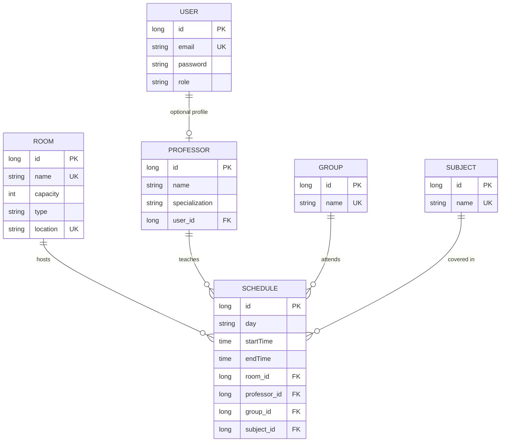

# Database Design: IS-Backend

## Overview
The `IS-Backend` uses a relational database schema (PostgreSQL) to manage university entities and their relationships.

## Entity-Relationship Diagram (ERD)

## Table Descriptions

### User & Professor
- **User**: Stores authentication credentials and role-based permissions (`ADMIN`, `USER`).
- **Professor**: Profile details linked to a specific user account. Specializations are used for scheduling logic.

### Infrastructure & Resources
- **Room**: Physical classrooms or facilities. Includes metadata like capacity and location.
- **Group**: Student cohorts (e.g., student years or classes).
- **Subject**: Academic courses that form the curriculum.

### Scheduling (Coordination)
- **Schedule**: The central coordinating table that links a Day/Time to a Room, Professor, Group, and Subject. Unique constraints and application logic ensure no double-booking occurs.

## Data Persistence Strategy
- **Hibernate**: Used for ORM (Object-Relational Mapping).
- **DDL Management**: In development, `spring.jpa.hibernate.ddl-auto` is typically set to `update` to automatically adjust the schema as entities evolve.
