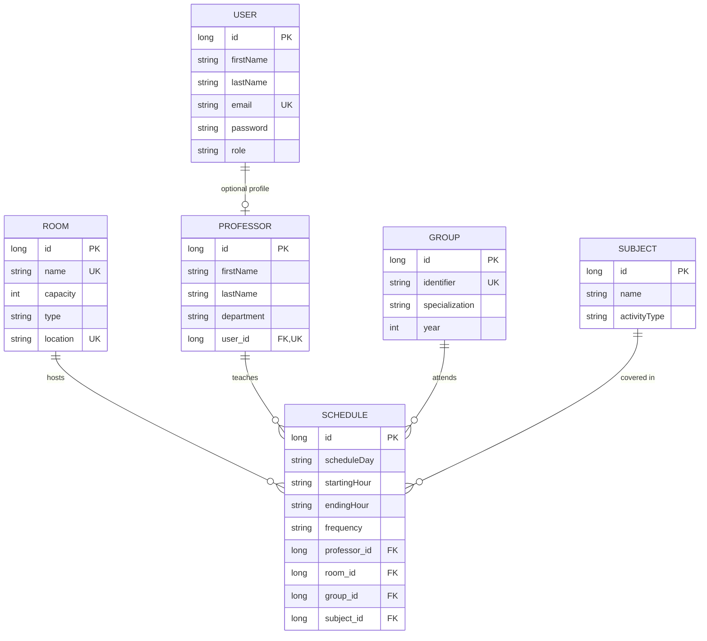

# Database Design: IS-Backend

## Overview
The `IS-Backend` uses a relational database schema (PostgreSQL) to manage university entities and their relationships. Schema is managed via **Flyway** migrations located in `src/main/resources/db/migration/`.

## Entity-Relationship Diagram (ERD)

## Table Descriptions

### User & Professor
- **User** (`users`): Stores authentication credentials (`email`, `password`), personal info (`firstName`, `lastName`), and role-based permissions (`ADMIN`, `USER`).
- **Professor** (`professors`): Teaching staff profile with `firstName`, `lastName`, and `department`. Linked 1:1 to a `User` account via `user_id`.

### Infrastructure & Resources
- **Room** (`rooms`): Physical classrooms or facilities. Includes `name` (unique), `capacity`, `type`, and `location` (unique).
- **Group** (`student_groups`): Student cohorts identified by a unique `identifier`, with `specialization` and `year`.
- **Subject** (`subjects`): Academic courses with `name` and `activityType` (e.g., lecture, lab, seminar).

### Scheduling (Coordination)
- **Schedule** (`schedules`): The central coordinating table that links a `scheduleDay`/time slot (`startingHour`, `endingHour`) to a Room, Professor, Group, and Subject. Includes a `frequency` field (`SAPTAMANAL`, `PARA`, `INPARA`) to support weekly/biweekly patterns. Application-level logic ensures no double-booking of rooms, professors, or groups at the same time slot and frequency.

## Data Persistence Strategy
- **Hibernate**: Used for ORM (Object-Relational Mapping) with `spring.jpa.hibernate.ddl-auto=validate`.
- **Flyway**: Manages database schema versioning via SQL migration scripts in `src/main/resources/db/migration/`. The initial schema is defined in `V1__Initial_Schema.sql`.
